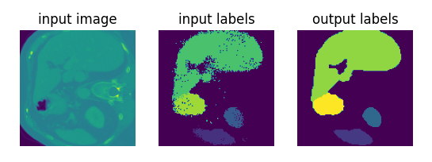

## Simple CRF example forked from: https://github.com/charliebudd/crf-example
Here is the list of changes/updates made to original repo:
- Added support for running example on CPU only
- Added description of steps to setup and run example
- Restructuring and timing decorator for both CPU/GPU versions added
- Added screenshot in readme, showing the expected output

The following has been run on Ubuntu 20.04 with Python 3.8

## Prepare venv
- [Optional] Create a virtualenv 

    `virtualenv venv -p python3.8`

- Activate venv
    
    `source venv/bin/activate`

- [Optional] If compiling for CPU, install torch for CPU

    `pip install torch==1.8.0+cpu torchvision==0.9.0^Cpu torchaudio==0.8.0 -f https://download.pytorch.org/whl/torch_stable.html`

- Install pre-requisites (build monai)
     
     `BUILD_MONAI=1 pip install -r requirements.txt`

## Run example

`python crf_test.py`

If all goes well, you will see the following output:

Change `run_in_3d = False` to `run_in_3d = True` to run the example in 3D

